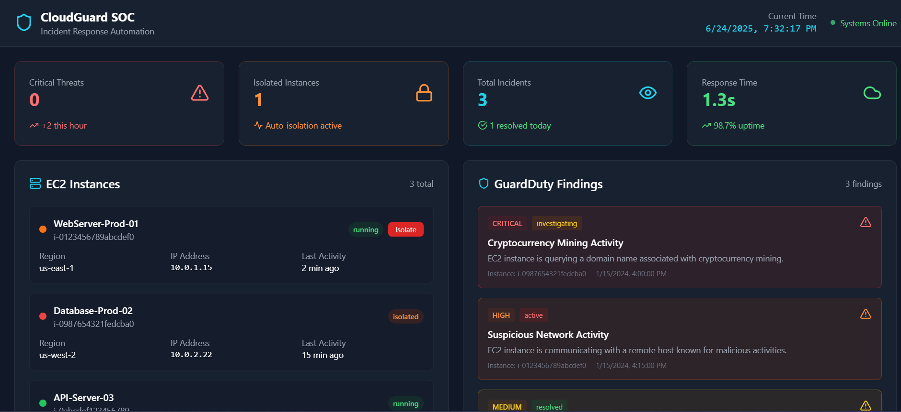

# ☁️ Cloud Incident Response Automation Dashboard

A modern dashboard that simulates **incident response automation** for cloud environments (e.g., AWS). Built with **React**, **TypeScript**, **Vite**, and **TailwindCSS**, the dashboard visualizes security alerts and automates EC2 isolation and threat mitigation.

---

## 🧠 Overview

This project showcases how a cloud security team can respond to incidents using automation. While front-end focused, it assumes backend functionality powered by AWS services like **CloudTrail**, **GuardDuty**, **Lambda**, and **Boto3** scripts.

The dashboard helps SOC analysts:
- View simulated alerts from cloud infrastructure
- Trigger automated isolation responses (conceptually)
- Analyze threat trends by severity and type

---
## 📸 Screenshot

---

## 🚀 Features

- 📊 Real-time visualization of security alerts
- ☁️ Simulation of GuardDuty detections
- 🔐 Mock EC2 instance isolation workflows
- 🎨 Tailwind-powered clean UI
- ⚡ Built with Vite for fast loading

---

🧪 Tech Stack

- React + TypeScript – Component-based architecture

- Vite – Blazing fast dev environment

- Tailwind CSS – Utility-first modern styling

- AWS Simulated Data – (GuardDuty/CloudTrail assumed)

---

💼 Use Cases

- Demonstrate cloud security awareness

- Showcase frontend engineering for incident response

- Practice DevSecOps/Dashboard building

- Portfolio project for Cybersecurity, Cloud, or Software roles
